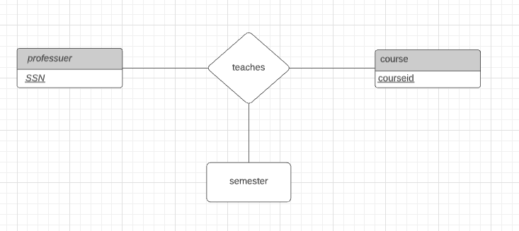
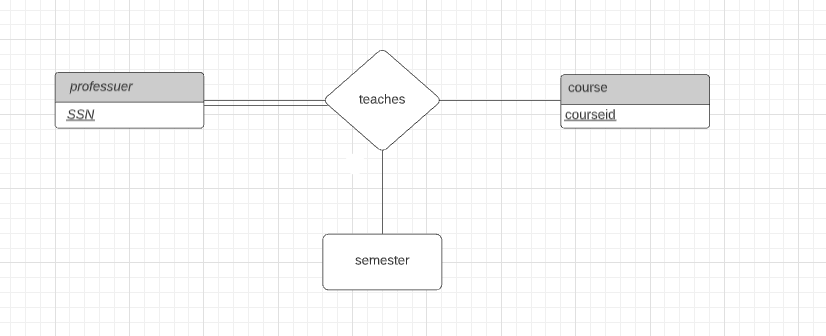
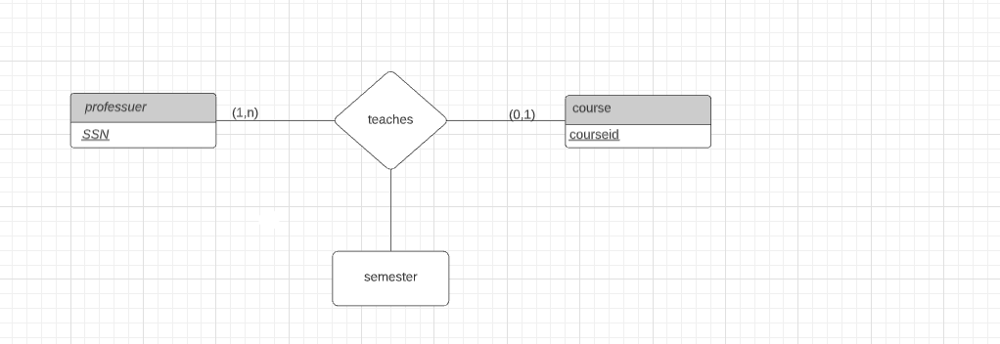
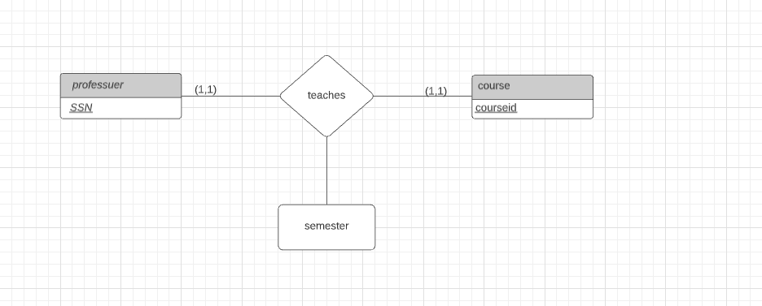
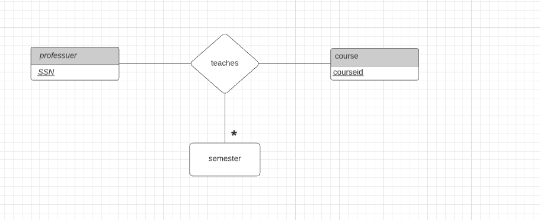

# csi2532_playground
# Laboratoire 3
## Pratique des diagrammes ER

| Nom              | Numéro d'étudiant | Email               |
| ---------------- | ----------------- | ------------------- |
| Emirali Gungor  | 300157209       | egung014@uottawa.ca |

#### Exercice 1

#### Exercice 2

#### Exercice 3

#### Exercice 4

#### Exercice 5 

#### Exercice 6

