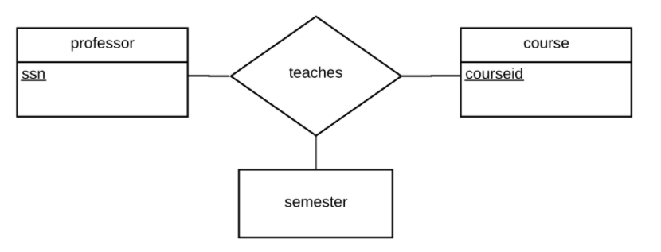
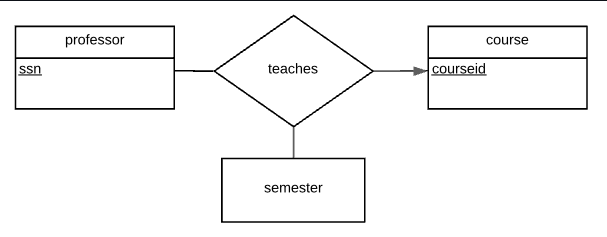
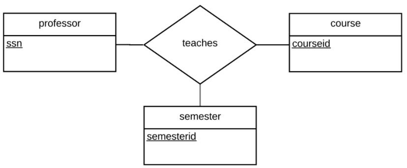
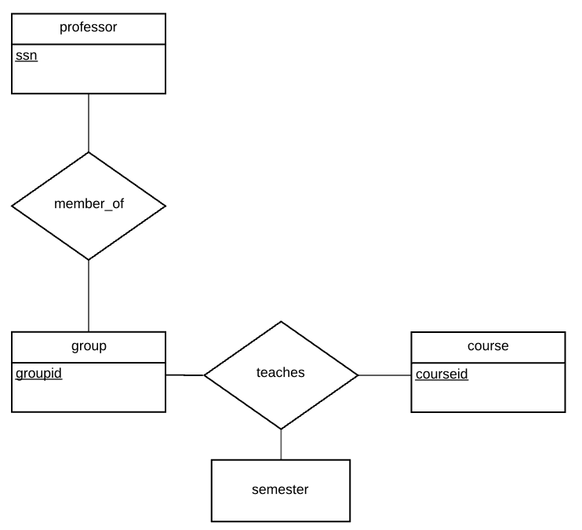
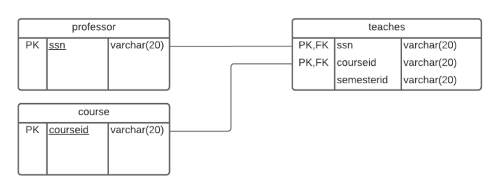
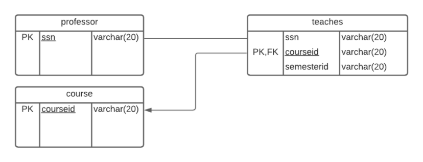
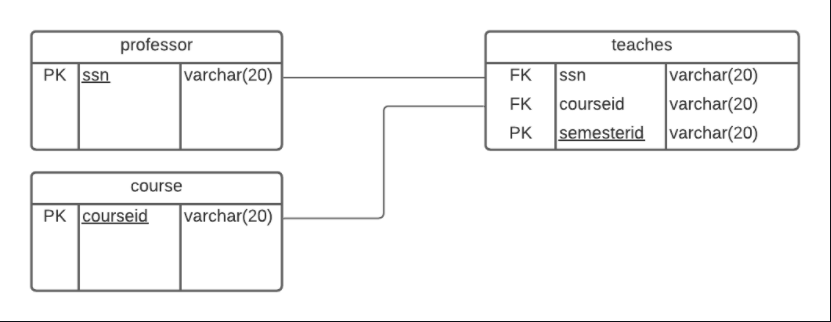
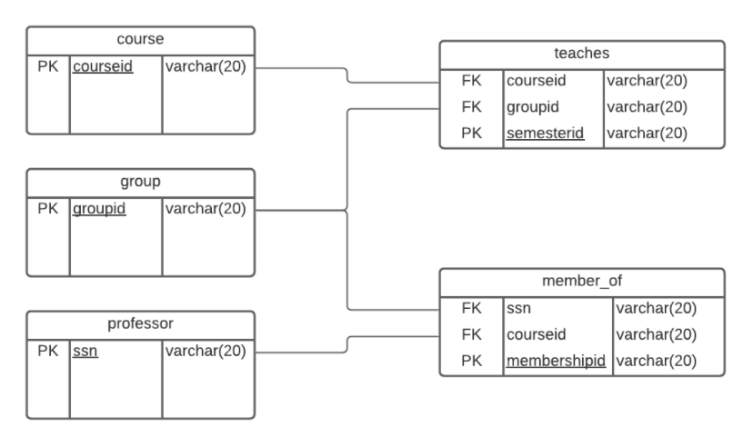

# csi2532_playground
# Laboratoire 4
##Systèmes univeritaire
Une base de données universitaire contient
des informations sur les professeurs
(identifié par le numéro de sécurité sociale
ou SSN) et les cours (identifié par courseid).
Les professeurs donnent des cours; chacun
de les situations suivantes concernent
l'ensemble de relation teaches.
S
| Nom              | Numéro d'étudiant | Email               |
| ---------------- | ----------------- | ------------------- |
| Emirali Gungor  | 300157209       | egung014@uottawa.ca |

### ER 1
Les professeurs peuvent enseigner le
même cours sur plusieurs semestres et seule
la plus récente doit être enregistrée.

### ER 3
Chaque professeur enseigne exactement
un cours (ni plus, ni moins).

### ER 5
Les professeurs peuvent enseigner le
même cours sur plusieurs semestres et
chaque doit être enregistrée.

### ER 6
Supposons maintenant que certains cours
puissent être enseignés conjointement par
une équipe de professeurs, mais il est
possible qu'aucun professeur dans une
équipe ne puisse enseigner le cours.
Modélisez cette situation en introduisant des
ensembles d'entités et des ensembles de
relations supplémentaires si nécessaire.

# Diagramme Relationnel

#### Diagramme 1

#### Diagramme 3

#### Diagramme 5

#### Diagramme 6

# Schéma Relationnel (SQL)

#### Schema 1

#### Schema 3

#### Schema 5

#### Schema 6

