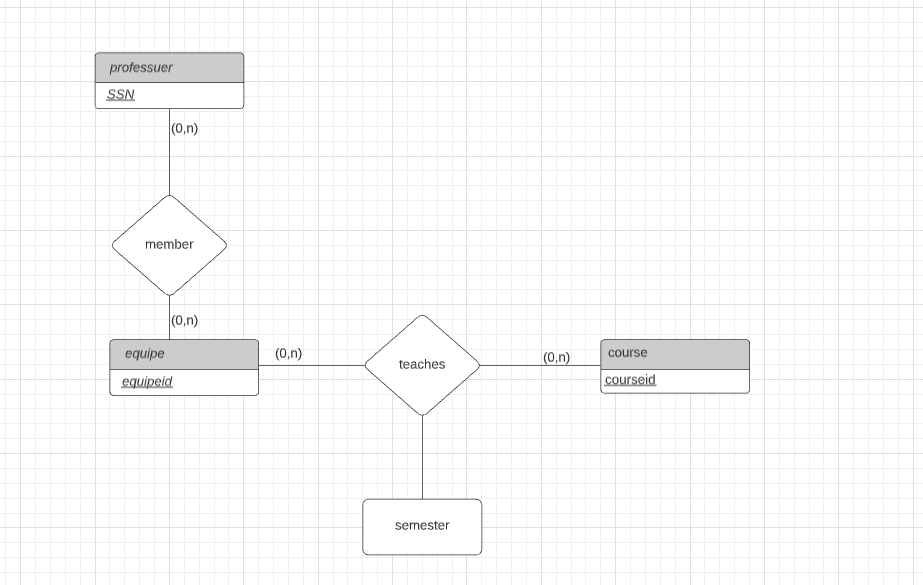

# csi2532_playground
# Laboratoire 3
## Pratique des diagrammes ER

| Nom              | Numéro d'étudiant | Email               |
| ---------------- | ----------------- | ------------------- |
| Emirali Gungor  | 300157209       | egung014@uottawa.ca |

#### Exercice 1
Les professeurs peuvent enseigner le
même cours sur plusieurs semestres et seule
la plus récente doit être enregistrée.

#### Exercice 2
Chaque professeur doit enseigner un
cours.

#### Exercice 3
Chaque professeur enseigne exactement
un cours (ni plus, ni moins).

#### Exercice 4
Chaque professeur enseigne exactement
un cours (ni plus, ni moins), et chaque cours
doit être enseigné par un professeur.

#### Exercice 5 
Les professeurs peuvent enseigner le
même cours sur plusieurs semestres et
chaque doit être enregistrée

#### Exercice 6
Supposons maintenant que certains cours
puissent être enseignés conjointement par
une équipe de professeurs, mais il est
possible qu'aucun professeur dans une
équipe ne puisse enseigner le cours.
Modélisez cette situation en introduisant des
ensembles d'entités et des ensembles de
relations supplémentaires si nécessaire.

